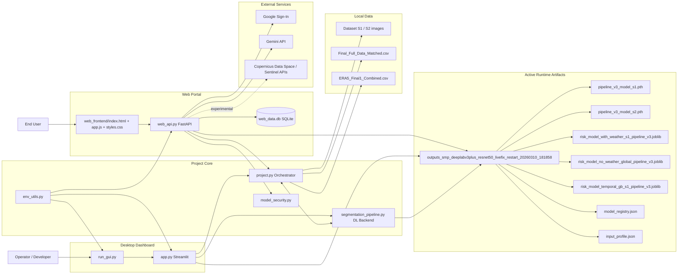
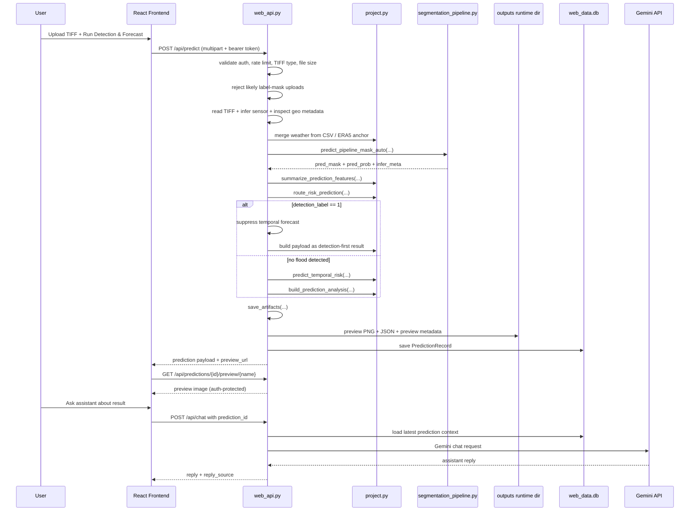
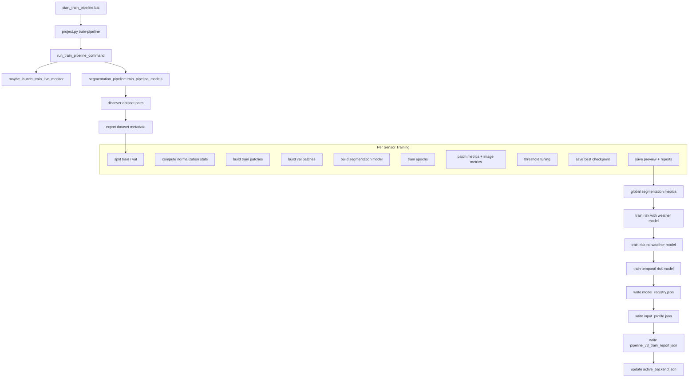
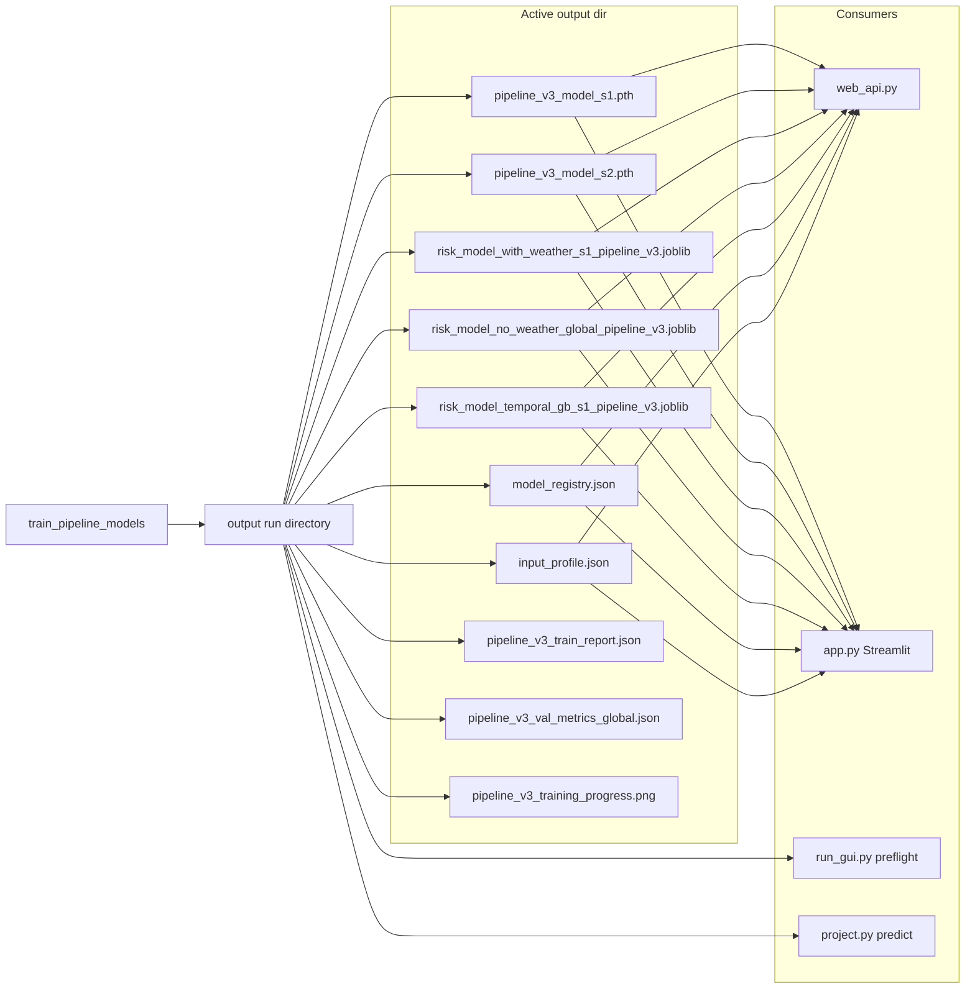

# Flood Project Architecture Diagrams

This document reflects the current project structure and runtime behavior of the repository.

The diagrams below are intentionally split by concern:
- overall system architecture
- web portal runtime
- prediction request flow
- training pipeline
- artifact and model lifecycle

The current production path is `Pipeline V3 only`. Legacy training/runtime is no longer part of the active flow.

## 1. Overall System Architecture



## 2. Web Portal Runtime

```mermaid
flowchart TD
    A[start_web.bat] --> B[run_web.py]
    B --> C[load .env]
    C --> D[dependency check]
    D --> E[uvicorn web_api:app]

    E --> F[/web static frontend]
    E --> G[/api/auth/*]
    E --> H[/api/predict]
    E --> I[/api/predictions/*]
    E --> J[/api/chat]
    E --> K[/api/live-satellite/*]

    subgraph WebAPI["web_api.py"]
        L[load models into LoadedModels]
        M[load auth + JWT + roles]
        N[load DB session]
        O[load assistant mode]
    end

    E --> L
    E --> M
    E --> N
    E --> O

    subgraph Frontend["web_frontend"]
        P[React UI]
        Q[Prediction form]
        R[History panel]
        S[Latest result]
        T[AI assistant panel]
    end

    F --> P
    P --> Q
    P --> R
    P --> S
    P --> T
```

## 3. Web Prediction Request Flow



## 4. Training Pipeline



## 5. Artifact and Runtime Lifecycle



## 6. Auth and Assistant Flow

```mermaid
flowchart LR
    U[Browser User] --> W[React Web UI]

    W --> A[/api/auth/register]
    W --> B[/api/auth/login]
    W --> C[/api/auth/google]
    C --> G[Google Identity Services]

    A --> API[web_api.py]
    B --> API
    C --> API
    API --> DB[(web_data.db users)]
    API --> JWT[JWT bearer token]

    W --> D[/api/chat]
    D --> API
    API --> HX[(chat_messages table)]
    API --> PR[(predictions table)]

    alt Gemini configured
        API --> GM[Gemini API]
        GM --> API
    else fallback
        API --> LF[local project-aware fallback]
    end

    API --> W
```

## 7. Live Satellite Experimental Path

```mermaid
flowchart TD
    U[User] --> W[Web Portal]
    W --> A[/api/live-satellite/search]
    W --> B[/api/live-satellite/predict]

    A --> LS[Copernicus Data Space search]
    B --> LS2[Copernicus chip fetch]
    LS2 --> API[web_api.py]
    API --> CORE[project.py]
    API --> DL[segmentation_pipeline.py]
    API --> DB[(web_data.db)]
    API --> OUT[preview + prediction artifacts]
```

## 8. Suggested Usage

If you need one diagram only for a report or presentation, use:
- Diagram 1 for the full project overview

If you need a technical defense, use:
- Diagram 1
- Diagram 3
- Diagram 4
- Diagram 5

If you need the web portal explanation only, use:
- Diagram 2
- Diagram 3
- Diagram 6
- Diagram 7
